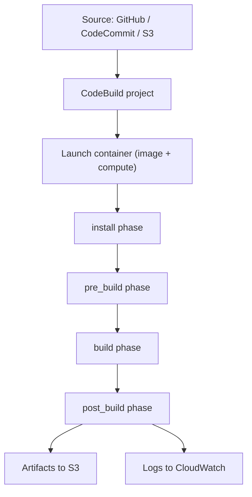

# 💚 AWS CodeBuild

## 💛 What is it?
**AWS CodeBuild** is a fully managed **CI build service**. You give it source code and a build spec, and it spins up a fresh container, runs your build and test commands, and produces artifacts. There are no build servers for you to run or patch.
**Plain version**
## 💛 Why do we need it?
- **No build infrastructure to manage.** CodeBuild provisions a clean container per build, runs many in parallel, and bills only for the minutes used.
- **AWS-native by design.** It authenticates with an IAM **service role** instead of stored credentials, can join your **VPC** to reach private resources, writes artifacts to **S3**, and streams logs to **CloudWatch**.
- **Reproducible builds.** Every build starts from the same image, so "works on my machine" stops being a problem.
### 🤍 Real-world use case
On every push, CodeBuild checks out the repo, installs deps, runs lint and tests, builds a Docker image, and pushes it to ECR, all inside a container that vanishes when it finishes. No Jenkins box to babysit.
## 💛 How it works
A CodeBuild **project** ties together: the source, the **environment** (build image plus compute size), the **buildspec**, the artifacts config, and a service role. On a trigger it launches a container from the image, clones the source, runs the buildspec phases in order, uploads artifacts and logs, then tears the container down.
### 🤍 Build flow

### 🤍 buildspec.yml
The build is defined by a `buildspec.yml` at the repo root (or inline in the project). Its phases run in a fixed order: `install`, `pre_build`, `build`, `post_build`. It also declares artifacts, cache, and environment variables.
```yaml
version: 0.2
phases:
  install:
    runtime-versions:
      nodejs: 20
    commands:
      - npm ci
  pre_build:
    commands:
      - npm run lint
  build:
    commands:
      - npm run build
      - npm test
  post_build:
    commands:
      - echo Build complete
artifacts:
  files:
    - dist/**/*
cache:
  paths:
    - node_modules/**/*
```
### 🤍 Example: start a build (CLI)
```bash
aws codebuild start-build --project-name my-app
```
## 💛 Where it fits
- **Standalone**, triggered by a source webhook on push or pull request (GitHub, CodeCommit, Bitbucket, S3).
- **As the Build stage of CodePipeline**: Source, then Build (CodeBuild), then Deploy. CodeBuild is the piece that actually compiles and tests; CodePipeline orchestrates the stages around it.
## 💛 Environment and compute
- **Image**: a managed image (Amazon Linux or Ubuntu with common runtimes preinstalled) or your **own Docker image** pulled from ECR.
- **Compute**: sized by vCPU and memory (small through 2xlarge), with ARM and GPU options.
- **Environment variables**: plaintext, or resolved from **SSM Parameter Store** or **Secrets Manager**. Do not hardcode secrets as plaintext.
- **VPC config**: attach the build to a VPC so it can reach a private RDS or ElastiCache.
## 💛 Cost
You pay **per build-minute**, priced by compute size, with no idle cost. Configuring a **cache** (S3 or local) so deps are not reinstalled every run both speeds builds and cuts the minutes you pay for.
## 💛 Gotcha
- **buildspec is strict.** It must be `version: 0.2`, and the phase names are fixed. A command that exits non-zero fails the phase (and the build) unless you handle it.
- **Never put secrets in plaintext env vars.** They surface in the console and logs. Reference Secrets Manager or Parameter Store instead.
- **The service role must allow what the build does.** Pushing to ECR, reading S3, writing logs all need explicit permissions. Missing ones produce confusing mid-build failures.
- **Caching is not automatic.** Without a configured cache, every build reinstalls dependencies from scratch, which is slow and costs more minutes.
- **CodeBuild vs GitHub Actions.** CodeBuild is AWS-native (IAM roles, VPC access); Actions sits closer to your repo. Many teams run Actions by default and reach for CodeBuild specifically when a build needs IAM-native access or to run inside a VPC.
## 💛 References
- AWS Docs: What is CodeBuild: https://docs.aws.amazon.com/codebuild/latest/userguide/welcome.html
- AWS Docs: buildspec reference: https://docs.aws.amazon.com/codebuild/latest/userguide/build-spec-ref.html
- AWS Docs: CodeBuild with CodePipeline: https://docs.aws.amazon.com/codebuild/latest/userguide/how-to-create-pipeline.html
