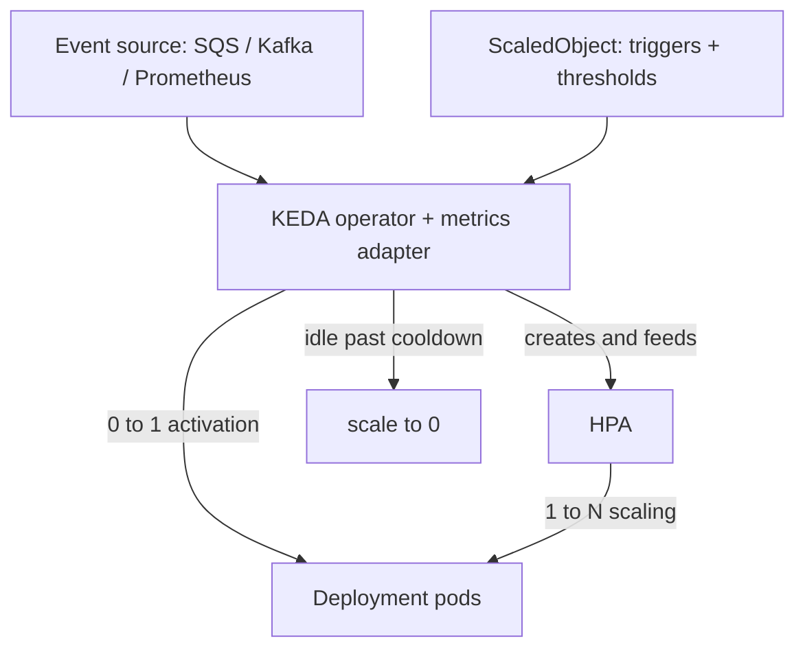

# 💚 KEDA (Kubernetes Event-Driven Autoscaling)

## 💛 What is it?
**KEDA (Kubernetes Event-Driven Autoscaling)** scales your workloads based on **events and external metrics**, not just CPU and memory, and it can scale **down to zero**. It is a lightweight add-on that extends the built-in Horizontal Pod Autoscaler (HPA).
Plain version: the default HPA scales on CPU and memory. KEDA lets you scale on real demand signals like "how many messages are in the queue," "Kafka consumer lag," "a Prometheus query result," or "a cron schedule," and it can drop to zero pods when there is no work.
## 💛 Why do we need it?
- **Real workloads scale on demand, not CPU.** A queue consumer should scale on **queue depth**. CPU can look idle while ten thousand messages pile up waiting.
- **Scale to zero.** An idle event consumer can sit at **0 pods** and cost nothing until work arrives. Plain HPA cannot go below 1.
- **Many sources out of the box.** KEDA ships 60+ scalers: SQS, Kafka, RabbitMQ, Redis, Prometheus, cron, and cloud services across AWS, GCP, and Azure.
### 🤍 Real-world use case
A worker reads jobs off an SQS queue. Most of the day the queue is empty, so KEDA keeps it at 0 pods. When 500 messages land, KEDA wakes it and scales to enough pods to drain the backlog, then scales back to 0 when the queue is empty again.
## 💛 How it works
You install the KEDA operator (via Helm). It runs two pieces: the **operator** (reconciles your config and handles the 0-to-1 activation) and a **metrics adapter** (feeds external metrics to an HPA for 1-to-N scaling). You then create a **ScaledObject** pointing at a Deployment, with triggers that define the event source and thresholds.
### 🤍 Flow

The key split: **KEDA owns 0 to 1** (waking a workload from zero), and a **standard HPA that KEDA generates owns 1 to N** (scaling with load).
### 🤍 Example: ScaledObject on an SQS queue
```yaml
apiVersion: keda.sh/v1alpha1
kind: ScaledObject
metadata:
  name: worker-scaler
spec:
  scaleTargetRef:
    name: worker              # the Deployment to scale
  minReplicaCount: 0          # scale to zero when idle
  maxReplicaCount: 50
  cooldownPeriod: 300         # wait 5 min of idle before going to 0
  triggers:
    - type: aws-sqs-queue
      metadata:
        queueURL: https://sqs.us-east-1.amazonaws.com/123456789/jobs
        queueLength: "5"      # target: 1 pod per 5 messages
        awsRegion: us-east-1
      authenticationRef:
        name: keda-aws-creds
```
### 🤍 ScaledObject vs ScaledJob
Use a ScaledObject for a steady consumer that processes many messages per pod; use a ScaledJob when each unit of work should be its own Kubernetes Job (this pairs with the Kubernetes Job note).
## 💛 Authentication
Secrets and cloud credentials are kept out of the ScaledObject with a **TriggerAuthentication** (namespaced) or **ClusterTriggerAuthentication** (cluster-wide) object, referenced by `authenticationRef`. On EKS this pairs naturally with **IRSA**, so the scaler reads the queue using a scoped IAM role instead of static keys (see the IRSA note).
## 💛 Gotcha
- **KEDA does 0 to 1, HPA does 1 to N.** Do not also hand-create your own HPA for the same target. KEDA already generates one, and two autoscalers fighting over the same Deployment conflict.
- **Scale-from-zero has a separate activation threshold.** `activationThreshold` decides when to wake from 0, distinct from the scaling threshold. If the queue never crosses activation, the workload stays at zero.
- **Cold start on wake.** The first message after idle waits for a pod to start. Great for async and batch, but not for latency-critical synchronous APIs.
- **cooldownPeriod prevents flapping.** Going straight back to 0 the instant a queue empties causes churn. The cooldown holds the last pod briefly before scaling to zero.
- **Do not scale on CPU when the real signal is the backlog.** Using CPU on a queue worker misses the whole point, since CPU can be low while work is queued.
- **Polling has a floor.** KEDA checks each source every `pollingInterval` (default 30s). Extremely bursty workloads may see a short lag before scaling reacts.
## 💛 References
- KEDA: Concepts: https://keda.sh/docs/latest/concepts/
- KEDA: Scalers list: https://keda.sh/docs/latest/scalers/
- KEDA: ScaledObject spec: https://keda.sh/docs/latest/reference/scaledobject-spec/
