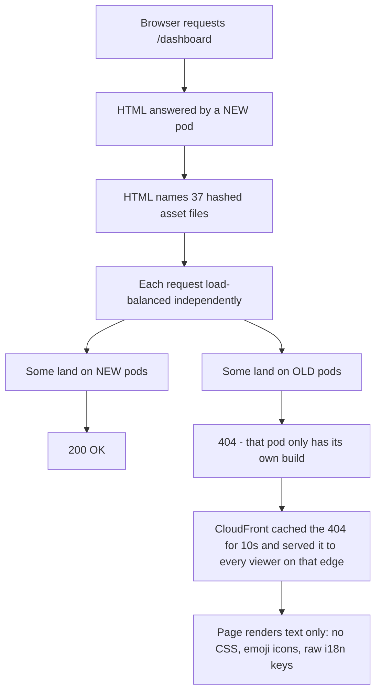

# 💚 Asset 404s on app.chartmetric.com

# 💚 Summary
For weeks some users opened app.chartmetric.com and got a page with no styling: no layout, emoji instead of icons, raw text like `throbberLoader.loading`. It was filed as a CDN cache problem for three weeks. It was not one.
The real cause is that **nothing pinned the HTML to the asset files it names**, so the two could come from different builds. Fixed on 2026-09-14 by serving build assets from S3 instead of from the pods, and by stopping CloudFront caching HTML at all.
Verified across **three consecutive production deploys: zero asset failures** in every rollout window, against 13 to 17 per minute before the fix.
Nothing was ever down and no data was at risk. The damage was trust, plus roughly $2,300 of unplanned CloudFront spend in August from a separate but overlapping traffic event.
# 💚 Impact
CloudFront cost was a separate story that happened to overlap. August finished at $4,432 against July's $1,419, driven by an Aug 5 to 12 crawler surge worth roughly $1,880 plus a traffic plateau. It decayed on its own to about $55/day by mid-September.
# 💚 Root cause
Opening a page is not one request. It is one for the HTML plus 37 for the JavaScript and CSS files that HTML names. Nine pods share the traffic, round robin, **no session affinity**. A pod only holds its own build's files.

## 💛 Two mechanisms, not one
### 🤍 Rollout skew, about 90 seconds per deploy
Old and new pods serve side by side while a deploy converges. Measured: a pod is ready 15 seconds after creation, and the load balancer needs two health checks 30 seconds apart before sending it traffic.
For a page to render correctly all 38 requests must hit the same generation of pod. With 25% of pods on the new build that is roughly a 1 in 50,000 chance, so during the window a cold page load is effectively guaranteed to break.
### 🤍 Stale HTML, hours to days
Prerendered pages carry `cache-control: s-maxage=31536000`, and the per-deploy invalidation only covers `/`, `/index.html` and `/*/index.html`. We measured `age: 23482` on live HTML naming a build from 14 hours and five deploys earlier. No pod had those files at all.
This one is not a race. It is a guaranteed failure until the HTML stops being used.
It turned out to be **two populations that look identical in the logs** and decay on completely different schedules:
Conflating these cost us a wrong prediction, recorded below.
## 💛 Why it looked random
An engineer opening the app to check their own deploy is standing in the only 90 seconds where the bug exists, with dev tools open and the cache disabled. Anyone investigating five minutes later was outside the window with a warm cache and saw a perfect page.
# 💚 What we ruled out
Recording these matters more than recording the cause, because three of them are the explanations we would otherwise still be repeating.
## 💛 The measurement that settled it
Bytes per request separates "the build changed" from "the traffic changed", and Cost Explorer gives it away free if you request `UsageQuantity` alongside `UnblendedCost`. It did not move. Same-sized requests, four times as many of them.
# 💚 What we shipped
## 💛 Why S3 fixes it
S3 has no concept of which build it is. The pods could only ever answer for the build they were running; the bucket answers for all of them, and old builds are never deleted. The race did not get rarer, it stopped being expressible.
## 💛 Design decisions worth knowing
### 🤍 No lifecycle expiry on the bucket
`s3 sync --size-only` never rewrites an object whose content is unchanged, so a vendor chunk stable across a year of builds keeps its original `LastModified`. Any age-based rule would eventually delete a file live HTML still references, reintroducing this exact bug on a slower clock. Pruning has to key off build manifests, not object age.
### 🤍 Routing by path, not a separate hostname
The first design served assets from `static.chartmetric.com` via Next's `assetPrefix`. Routing `/_next/static/*` on the existing distribution instead keeps the assets same-origin, which removed a certificate, a DNS record, a CORS requirement, `crossOrigin: 'anonymous'`, and three environment variables. It also removed the risk of a cross-origin font failing silently, which is the emoji-instead-of-icons symptom we were fixing.
### 🤍 Behaviour order is load-bearing
CloudFront takes the **first** matching behaviour, not the most specific one. `/_next/static/*` has to precede `*.js` and `*.css` or they swallow it.
# 💚 Results
For context, the preceding hours ran at 1.8 to 4.4 per 10k, and on Sept 11 we measured 102 asset 404s in 24 minutes hitting 50 of 2,194 viewers.
## 💛 Three deploys, counting 403 and 404 together
The first result above counted only 404s, which was misleading: S3 returns **403** for a missing key when the caller lacks `ListBucket`, so swapping the origin silently relabelled the entire failure population. Every figure below counts both.
Before the fix, a deploy minute produced 13 to 17 failures across 3 to 12 viewers. The third deploy ran on a fully clean baseline, with HTML caching already off and the edge already invalidated, so nothing in it needed explaining away.
## 💛 The cutover itself
Switching the origin produced a one-minute burst, because everyone holding pre-sync HTML failed at the same instant instead of spread over hours:
It self-resolved inside 60 seconds. Predictable in hindsight and not predicted.
## 💛 Stopping HTML caching
HTML edge hits stepped to zero at the invalidation and stayed there, which is the signature of a flush rather than an expiry:
# 💚 24 hours later
Checked 2026-09-15 against a full day of CloudFront logs.
## 💛 It held
## 💛 The overnight spike that was not one
Affected clients climbed from about 40 an hour to 155 overnight, which looked like a regression. It was **Googlebot**:
```javascript
Mozilla/5.0 (Linux; Android 6.0.1; Nexus 5X Build/MMB29P) ... (compatible; Googlebot/2.1; +http://www.google.com/bot.html)
```
797 of 907 failures, 88%, across 223 of 231 clients. It is re-crawling asset URLs from its index that belonged to builds predating the bucket. Those URLs will never exist again and Google drops them over time. It costs nothing and misleads no user.
Filtering bots out, the human line never moved: 0 to 5 viewers an hour across both days, before and after the spike.
## 💛 Two corrections to earlier figures on this page
**"About 27 failures an hour" and "0.7% of viewers" counted bots.** The real figure is 2 to 5 viewers an hour, about 0.02%. Roughly 30x too pessimistic.
**A rate keyed to cache misses gets worse when caching improves.** Static requests per viewer dropped 3.5x once assets started carrying a one-year TTL from S3, so the remaining static requesters are disproportionately new visitors and broken clients. The per-10k rate looked like it exploded while the absolute human count was flat. Use distinct viewers over all traffic as the denominator, not static requests.
## 💛 Operational note
Exclude bots from any alert built on this metric, or the first crawl wave pages someone at 4am.
